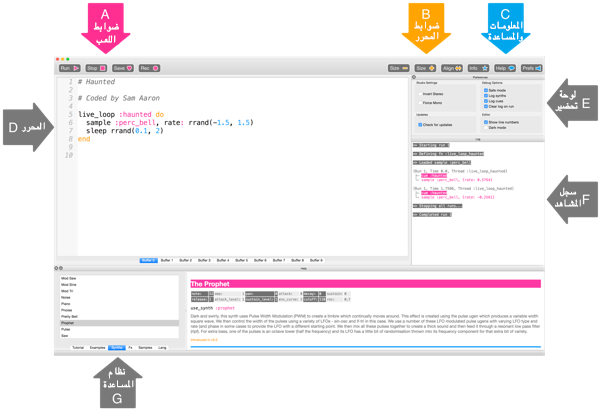

## أعزف لحنك الأول

يتيح لك Sonic Pi ببرمجة الموسيقى. لنبدأ بعزف بعض النوتات الموسيقية البسيطة.

[[[sonic-pi-install]]]

+ قم بتشغيل Sonic Pi. سيتمكن قائد النادي من إخبارك، اين يمكنك العثور عليه. إذا كنت تستخدم Raspberry Pi ، فهذا ضمن البرمجة في القائمة.
    
    

+ انظر أين تقول '#مرحبا بك في Sonic Pi'؟ ادناه هو النوع:
    
    

+ انقر فوق 'Run'. هل سمعت نوتة موسيقية؟ إذا لم تستمع، تأكد من أن الصوت غير مكتووم على جهاز الكمبيوتر الخاص بك وأن مستوى الصوت مرتفع بما فيه الكفاية. إذا كان الصوت عالياً جدًا فقم بخفضه.
    
    إذا كنت تستخدم Raspberry Pi، فتأكد من أنك تستخدم شاشة HDMI مع مكبرات الصوت أو لديك مكبرات صوت أو سماعات متصلة بمقبس الصوت.
    
    هناك أيضًا إعداد لمستوى الصوت ضمن "Prefs" يمكنك ضبطه.

+ أضف الآن سطرًا آخر أسفل الخط الأول:
    
    

+ انقر فوق 'Run'. هل سمعت ما كنت تتوقعه؟ في Sonic Pi، تشغيل ` ` يعني بدء اللعب، لذلك تبدأ في عزف النغمة الأولى ثم تبدأ على الفور في عزف النغمة الثانية حتى تسمع النغمتين في نفس الوقت.

+ للوصول الى النغمة الثانية للتشغيل بعد النغمة الأولى، أضف سطر ` sleep 1 ` بحيث تبدو الكود البرمجي كما يلي:
    
    

+ الآن قم بتشغيل الكود البرمجي الخاص بك ويجب أن يبدو مثل جرس الباب.
    
    أستمع ويجب أن تسمع صوتًا أعلى ثم صوتًا أقل. تحتوي النغمات العليا على نوتات أعلى.
    
    

      <audio controls preload> <source src="resources/doorbell-1.mp3" type="audio/mpeg"> Your browser does not support the <code>audio</code> element. </audio>
    

+ احفظ الكود البرمجي بالنقر على 'حفظ Save' واعط اسم ملفك 'doorbell.txt'.
    
    
    
    إذا كنت غير متأكد، تحقق مع قائد النادي الخاص بك اين يجب ان تحفظ ملفك.
    
    يمكنك تحميل الملفات مرة أخرى إلى Sonic Pi بالنقر على 'التحميل Load'.