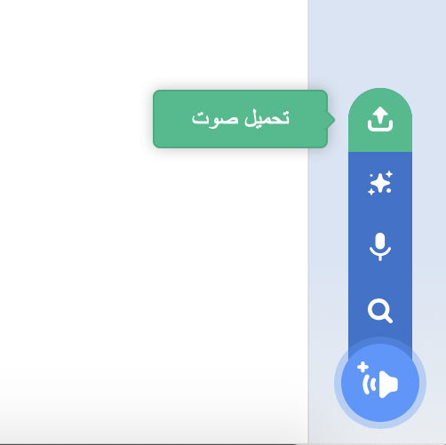

## تسجيل اللحن

الآن دعونا نقوم بتسجيل لحن جرس الباب حتى تتمكن من تشغيله خارج Sonic Pi. يمكن لـ Sonic Pi إنشاء `Wav` ملفات الصوت الشائعة الاستخدام.

+ انقر على زر "Rec" لبدء التسجيل.
    
    

+ ثم انقر فوق "Run" لتشغيل نغمة جرس الباب الخاص بك.
    
    

+ عند الانتهاء انقر فوق 'Rec' مرة أخرى لإيقاف التسجيل وسيتم مطالبتك باسم الملف. افتح ملفك 'doorbell.wav'.
    
    

+ إذا كان لديك برنامج يمكنه تشغيل ملفات '.wav' فسوف تتمكن من تشغيل النغمة الخاصة بك في جرس الباب خارج Sonic Pi.
    
    نصيحة: إذا لم يكن لديك برنامج آخر يمكنه تشغيل ملفات '.wav' فيمكنك استيراد الصوت إلى Scratch وتشغيله.
    
    
    
    نصيحة: قد تحتاج إلى إغلاق Sonic Pi لتتمكن من تشغيل الصوت باستخدام تطبيق آخر.