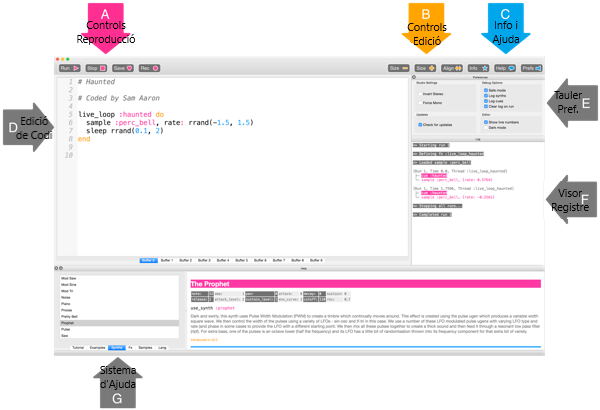

## Reprodueix les primeres notes

Sonic Pi et permet programar música. Comencem per reproduir algunes notes musicals senzilles.

[[[sonic-pi-install]]]

+ Executa Sonic Pi. El líder del teu club et podrà dir on trobar-lo. Si fas servir una Raspberry Pi, el trobaràs a l'apartat Programació del menú.
    
    

+ Veus on diu #Benvingut a Sonic Pi'? A sota, escriu:
    
    

+ Fes clic a 'Run'. Has escoltat una nota musical? Si no, assegura't que el so no està silenciat a l’ordinador i que el volum és prou alt. Si el so és massa fort, baixa'l.
    
    If you're using a Raspberry Pi then make sure you are using either an HDMI monitor with speakers or have speakers or headphones connected to the audio jack.
    
    There's also a volume setting under 'Prefs' that you can adjust.

+ Now add another line below your first one:
    
    

+ Click 'Run'. Did you hear what you were expecting? In Sonic Pi, `play` means start playing, so it starts playing the first note and then immediately starts playing the second note so you hear both notes at the same time.

+ To get the second note to play after the first note add a `sleep 1` line in between so that your code looks like this:
    
    

+ Now run your code and it should sound like a doorbell chime.
    
    Listen and you should hear a higher note and then a lower one. Higher notes have higher numbers.
    
    

      <audio controls preload> <source src="resources/doorbell-1.mp3" type="audio/mpeg"> Your browser does not support the <code>audio</code> element. </audio>
    

+ Save your code by clicking on 'Save' and name your file 'doorbell.txt'.
    
    
    
    If you're not sure, check with your Club Leader where you should save your file.
    
    You can load files back into Sonic Pi by clicking on 'Load'.