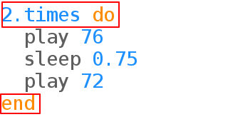

## Fes que el so del timbre es repeteixi

Els timbres de les portes sovint repeteixen la tonada.

+ Posa el timbre de la porta dins d'un bucle:
    
    
    
    Sonic Pi will helpfully indent the doorbell chime code inside the `times` loop.

+ Escolta el timbre. És el que esperaves?
    
    You'll need to add a `sleep` line at the end so that there's a pause before repeating:
    
    

+ Listen to the chime again and it should sound better.
    
    

      <audio controls preload> <source src="resources/doorbell-2.mp3" type="audio/mpeg"> Your browser does not support the <code>audio</code> element. </audio>
    
