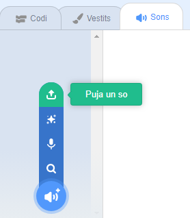

## Enregistra el teu timbre

Ara anem a gravar el timbre de la porta perquè puguis reproduir-lo fora de Sonic Pi. Sonic Pi pot crear fitxers `wav` que es solen utilitzar com a fitxers de so.

+ Fes clic al botó "Rec" per començar a gravar.
    
    

+ A continuació, fes clic a "Run" per reproduir el teu timbre de la porta.
    
    

+ Quan acabi, fes clic a "Rec" de nou per deixar de gravar i se't demanarà un nom de fitxer. Anomena'l "timbredeporta.wav".
    
    

+ Si tens un programa que pugui reproduir fitxers ".wav", aleshores podràs reproduir el timbre de la porta fora de Sonic Pi.
    
    Consell: Si no tens un altre programa que pugui reproduir fitxers '.wav', podries importar el so a Scratch i reproduir-lo.
    
    
    
    Consell: Potser has de tancar Sonic Pi per poder reproduir so mitjançant una altra aplicació.