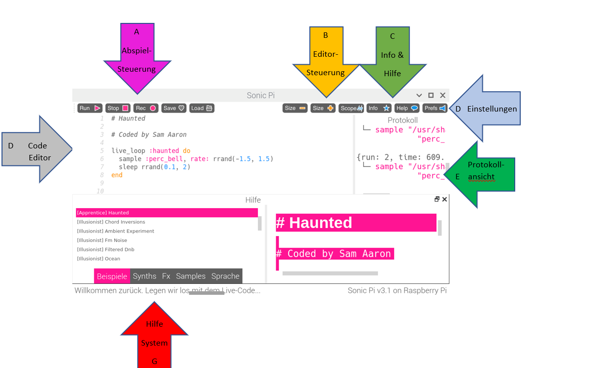
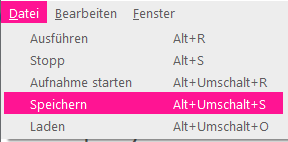

## Spiele die ersten Noten

Mit Sonic Pi kann man Musik programmieren. Beginnen wir mit ein paar einfachen Noten.

[[[sonic-pi-install]]]

+ Starte Sonic Pi. Dein Clubleiter kann dir sagen, wie du Sonic Pi starten kannst. Auf dem Raspberry Pi findest du Sonic Pi im Menü "Programmierung".
    
    

+ Siehst du, wo es heißt: "Willkommen bei Sonic Pi"? Tippe das folgende Kommando direkt darunter:
    
    

+ Klicke auf "Ausführen". Hast du einen Ton gehört? Wenn nicht, stelle sicher, dass der Ton auf deinem Computer nicht stummgeschaltet ist und die Lautstärke hoch genug ist. Wenn der Ton zu laut ist, drehe die Lautstärke herunter.
    
    Wenn du einen Raspberry Pi verwendest, stelle sicher, dass entweder ein HDMI-Monitor mit Lautsprechern am HDMI-Ausgang oder Lautsprecher oder Kopfhörer an der Audiobuchse angeschlossen sind.
    
    Unter 'Prefs' kann man die Lautstärke einstellen.

+ Füge nun eine weiteres Kommado unter dem ersten hinzu:
    
    

+ Klicke auf "Ausführen". Hast du das gehört, was du erwartet hast? Bei Sonic Pi bedeutet `play`, dass die Wiedergabe beginnt. Der erste und zweite Ton werden gleichzeitig abgespielt.

+ Um den zweiten Ton nach dem ersten abzuspielen, füge ein `sleep 1` Kommando dazwischen ein, so dass der Code folgendermaßen aussieht:
    
    

+ Führe den Code nun aus und es sollte sich wie eine Türklingel anhören.
    
    Du solltest eine höhere und dann eine tiefere Note hören. Höhere Noten entsprechen höheren Zahlen.
    
    

      <audio controls preload> <source src="resources/doorbell-1.mp3" type="audio/mpeg"> Ihr Browser unterstützt das <code>Audio-</code> Element nicht. </audio>
    

+ Speichere den Code, indem du auf 'Speichern' klickst. Nenne die Datei 'doorbell.txt'.
    
    
    
    Wenn du dir nicht sicher bist, frage deinen Clubleiter wo du die Datei speichern sollst.
    
    Du kannst Dateien wieder in Sonic Pi laden, indem du auf "Laden" klickst.