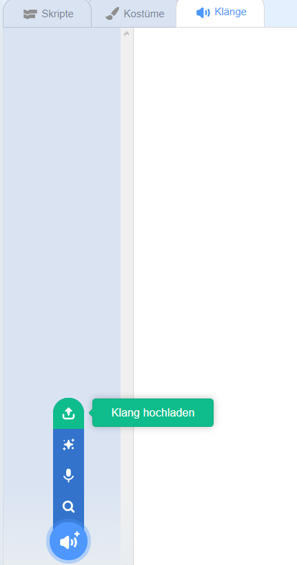

## Aufnahme Ihres Glockenspiels

Lassen Sie uns jetzt den Klingelton aufnehmen, damit Sie ihn außerhalb von Sonic Pi abspielen können. Sonic Pi kann `WAV-` Dateien erstellen, die häufig als Sounddateien verwendet werden.

+ Klicken Sie auf die Schaltfläche 'Rec', um die Aufnahme zu starten.
    
    

+ Klicken Sie anschließend auf "Ausführen", um den Klingelton zu spielen.
    
    

+ Wenn der Vorgang abgeschlossen ist, klicken Sie erneut auf 'Rec', um die Aufnahme zu beenden. Sie werden aufgefordert, einen Dateinamen einzugeben. Nennen Sie Ihre Datei "doorbell.wav".
    
    

+ Wenn Sie ein Programm haben, das ".wav" -Dateien abspielen kann, können Sie Ihr Klingelzeichen außerhalb von Sonic Pi abspielen.
    
    Tipp: Wenn Sie kein anderes Programm haben, das ".wav" -Dateien abspielen kann, können Sie den Sound in Scratch importieren und abspielen.
    
    
    
    Tipp: Möglicherweise müssen Sie Sonic Pi schließen, um mit einer anderen App Sound abspielen zu können.