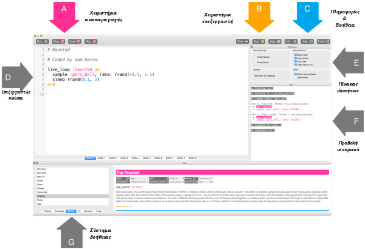
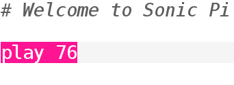

## Παίξε τις πρώτες σου νότες

Το Sonic Pi σου επιτρέπει να προγραμματίσεις μουσική. Ας ξεκινήσουμε παίζοντας μερικές απλές μουσικές νότες.

[[[sonic-pi-install]]]

+ Εκτέλεσε το Sonic Pi. Ο συντονιστής της ομάδας σου θα είναι σε θέση να σου πει πού να το βρεις. Εάν χρησιμοποιείς ένα Raspberry Pi, τότε βρίσκεται στην ενότητα "Προγραμματισμός" στο μενού.
    
    

+ Είδες πού λέει "#Καλώς ήλθατε στο Sonic Pi"; Κάτω από αυτό, πληκτρολόγησε:
    
    

+ Κάνε κλικ στο «Run». Άκουσες μια μουσική νότα; Εάν όχι, βεβαιώσου ότι ο ήχος δεν είναι σε σίγαση στον υπολογιστή σου και ότι η ένταση είναι αρκετά υψηλή. Εάν ο ήχος είναι πολύ δυνατός, χαμήλωσέ τον.
    
    Εάν χρησιμοποιείς Raspberry Pi, βεβαιώσου ότι χρησιμοποιείς είτε μια οθόνη HDMI με ηχεία είτε ότι έχεις συνδέσει ηχεία ή ακουστικά στην υποδοχή ήχου.
    
    Υπάρχει επίσης μια ρύθμιση έντασης στην περιοχή «Prefs» που μπορείς να την προσαρμόσεις.

+ Τώρα πρόσθεσε άλλη μια γραμμή κάτω από την πρώτη:
    
    

+ Κάνε κλικ στο «Run». Άκουσες αυτό που περίμενες; Στο Sonic Pi, η εντολή `play` σημαίνει να αρχίσει να αναπαράγει, οπότε αρχίζει να παίζει την πρώτη νότα και αμέσως μετά αρχίζει να παίζει τη δεύτερη νότα, ώστε να ακούς και τις δύο νότες ταυτόχρονα.

+ Για να παίξει η δεύτερη νότα μετά την πρώτη πρόσθεσε ενδιάμεσα μια γραμμή `sleep 1` έτσι ώστε ο κώδικάς σου να μοιάζει κάπως έτσι:
    
    

+ Τώρα εκτέλεσε τον κώδικά σου και θα πρέπει να ακούγεται σαν ένας ήχος κουδουνιού.
    
    Άκου και θα πρέπει να ακούσεις μια υψηλότερη νότα και μετά μια χαμηλότερη. Οι υψηλότερες νότες έχουν υψηλότερους αριθμούς.
    
    

    <audio controls preload> 
      <source src="resources/doorbell-1.mp3" type="audio/mpeg"> 
    Το πρόγραμμα περιήγησής σου δεν υποστηρίζει αυτό το <code>ηχητικό</code> στοιχείο. 
    </audio>
    

+ Αποθήκευσε τον κώδικά σου κάνοντας κλικ στο «Save» και ονόμασε το αρχείο σου ως "doorbell.txt".
    
    
    
    Εάν δεν είσαι βέβαιος, επιβεβαίωσε με τον συντονιστή της ομάδας σου πού πρέπει να αποθηκεύσεις το αρχείο σου.
    
    Μπορείς να φορτώσεις αρχεία πίσω στο Sonic Pi κάνοντας κλικ στο «Load».