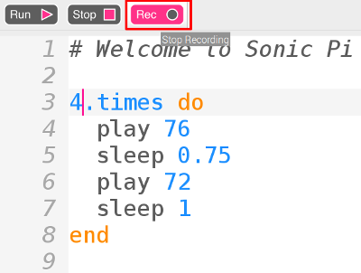
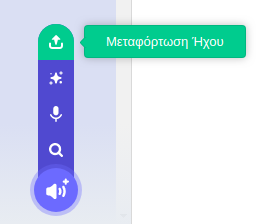

## Ηχογράφηση του ήχου σου

Τώρα ας ηχογραφήσουμε τον ήχο του κουδουνιού, ώστε να μπορείς να τον αναπαράγεις έξω από το Sonic Pi. Το Sonic Pi μπορεί να δημιουργήσει αρχεία `wav` που χρησιμοποιούνται συνήθως ως αρχεία ήχου.

+ Κάνε κλικ στο κουμπί «Rec» για να ξεκινήσει η ηχογράφηση.
    
    

+ Στη συνέχεια, κάνε κλικ στο «Run» για να αναπαραχθεί ο ήχος του κουδουνιού.
    
    

+ Όταν τελειώσει, κάνε ξανά κλικ στο «Rec» για να σταματήσεις την ηχογράφηση και να σου ζητηθεί ένα όνομα αρχείου. Δώσε το όνομα «doorbell.wav» στο αρχείο σου.
    
    

+ Εάν έχεις ένα πρόγραμμα που μπορεί να αναπαράγει αρχεία «.wav» τότε θα μπορείς να αναπαράγεις τον ήχο του κουδουνιού σου έξω από το Sonic Pi.
    
    Συμβουλή: Εάν δεν έχεις άλλο πρόγραμμα που μπορεί να αναπαράγει αρχεία «.wav» τότε θα μπορούσες να εισαγάγεις τον ήχο στο Scratch και να τον αναπαράγεις εκεί.
    
    
    
    Συμβουλή: Ίσως χρειαστεί να κλείσεις το Sonic Pi για να μπορείς να αναπαραγάγεις ήχο με τη χρήση άλλης εφαρμογής.