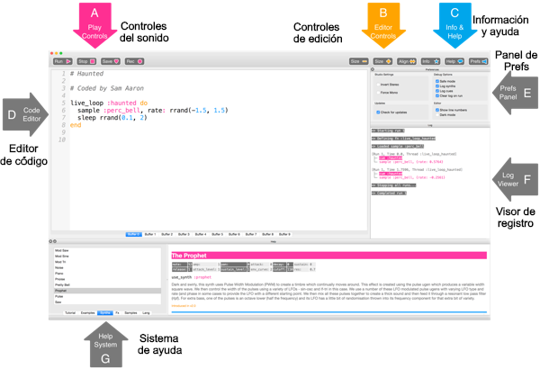

## Toca tus primeras notas

Sonic Pi te permite programar música. Empecemos tocando algunas notas musicales simples.

[[[sonic-pi-install]]]

+ Ejecutar Sonic Pi. Tu líder del Club podrá decirte dónde encontrarlo. Si estás usando una Raspberry Pi entonces está en el menú, bajo Programación.
    
    

+ ¿Ves dónde dice '#Bienvenido a Sonic Pi'? Debajo escribe:
    
    

+ Haz clic en "Ejecutar" o 'Run'. ¿Has oído una nota musical? Si no, asegúrate de que el sonido en tu ordenador no está silenciado y que el volumen está lo suficientemente alto. Si el sonido es demasiado fuerte, bájalo.
    
    Si estás usando una Raspberry Pi entonces asegúrese de que estás utilizando un monitor HDMI con altavoces o tienes altavoces o auriculares conectados a la toma de audio.
    
    También hay una configuración de volumen bajo 'Prefs' que se puede ajustar.

+ Ahora añade otra línea debajo de la primera:
    
    

+ Haz clic en 'Run' o "Ejecutar". ¿Has oído lo que esperabas? En Sonic Pi, `play` significa empezar a sonar, lo que hace que comience a reproducir la primera nota e inmediatamente después se empiece a reproducir la segunda, lo que hace que se escuchen ambas notas al mismo tiempo.

+ Para hacer que la segunda nota se reproduzca después de la primera, agrega en medio una línea `sleep 1` para que tu código se vea así:
    
    

+ Ahora ejecuta tu código y debería sonar como el timbre de una puerta.
    
    Escucha, deberías oír una nota más alta y luego una más baja. Las notas más altas tienen números más altos.
    
    

      <audio controls preload> <source src="resources/doorbell-1.mp3" type="audio/mpeg"> Tu navegador no es compatible con el elemento <code>audio</code>. </audio>
    

+ Guarda tu código haciendo clic en 'Save' o 'Guardar' y nombra tu archivo 'doorbell.txt'.
    
    
    
    Si no estás seguro, comprueba con tu líder del Club dónde deberías guardar tu archivo.
    
    Puedes cargar archivos de nuevo en Sonic Pi haciendo clic en 'Load' o 'Cargar'.