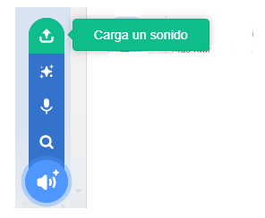

## Graba tu timbre

Ahora vamos a grabar el timbre de puerta para que puedas reproducirlo fuera de Sonic Pi. Sonic Pi puede crear archivos `wav` que son archivos de sonidos usados habitualmente.

+ Haz clic en el botón 'Rec' para empezar a grabar.
    
    

+ Luego haz clic en 'Run' o 'Ejecutar' para que suene tu timbre.
    
    

+ Cuando termine haz clic en 'Rec' otra vez para detener la grabación, te pedirá un nombre para el archivo. Llama a tu archivo 'doorbell.wav'.
    
    

+ Si tienes un programa que pueda reproducir archivos '.wav' entonces podrás reproducir tu timbre fuera de Sonic Pi.
    
    Consejo: Si no tienes otro programa que pueda reproducir archivos '.wav', entonces puedes importar el sonido a Scratch y reproducirlo.
    
    
    
    Consejo: Puede que necesites cerrar Sonic Pi para poder reproducir sonidos usando otra aplicación.