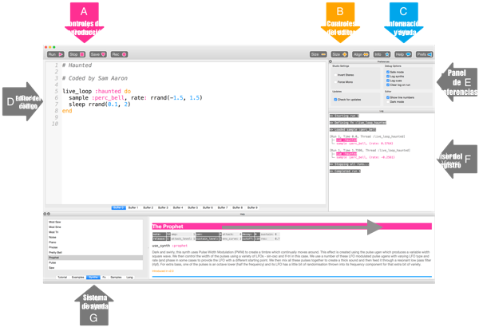

## Toca tus primeras notas

Sonic Pi te permite programar música. Empecemos tocando algunas notas musicales simples.

[[[sonic-pi-install]]]

+ Ejecuta Sonic Pi. Tu líder del club podrá decirte dónde encontrarlo. Si estás usando una Raspberry Pi, puedes encontrarlo bajo Programación en el menú.
    
    

+ ¿Ves donde dice '#Bienvenido a Sonic Pi'? Debajo de allí escribe:
    
    

+ Haz clic en "Ejecutar". ¿Escuchaste una nota musical? Si no, asegúrate de que el sonido no esté silenciado en tu computador y que el volumen sea lo suficientemente alto. Si el sonido es demasiado fuerte, baja el volumen.
    
    Si estás utilizando una Raspberry Pi, asegúrate de estar utilizando un monitor HDMI con altavoces, o ten altavoces o auriculares conectados a la toma de audio.
    
    También hay una configuración de volumen en 'Prefs' que puedes ajustar.

+ Ahora añade otra línea debajo de la primera:
    
    

+ Haz clic en "Ejecutar". ¿Escuchaste lo que estabas esperando? En Sonic Pi, `play` significa empezar a reproducir, por lo que empieza a sonar la primera nota y luego de inmediato empieza a sonar la segunda nota, de forma que se escuchan ambas notas al mismo tiempo.

+ Para que la segunda nota suene después de la primera, agregue un `sleep 1` entre las otras dos línea para que tu código se vea así:
    
    

+ Ahora ejecuta tu código y debería sonar como un timbre de puerta.
    
    Pon atención y deberías escuchar una nota más alta y luego una más baja. Las notas más altas tienen números más altos.
    
    

      <audio controls preload> <source src="resources/doorbell-1.mp3" type="audio/mpeg"> Tu navegador no tiene soporte para el elemento de <code>audio</code>. </audio>
    

+ Guarda tu código haciendo clic en 'Guardar' y nombra al archivo 'doorbell.txt'.
    
    
    
    Si no estás seguro, comprueba con tu líder del club dónde deberías guardar tu archivo.
    
    Puede cargar archivos en Sonic Pi haciendo clic en 'Cargar'.