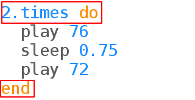

## Repetir el timbre

Los timbres a menudo repiten los sonidos.

+ Pongamos el timbre de puerta en un bucle:
    
    
    
    Sonic Pi sangrará de forma útil el código de timbre de puerta dentro del bucle `times`.

+ Escucha el timbre. ¿Es lo que esperabas?
    
    Necesitarás añadir una línea `sleep` al final para que haya una pausa antes de repetir:
    
    

+ Escucha el timbre nuevamente y debería sonar mejor.
    
    

      <audio controls preload> <source src="resources/doorbell-2.mp3" type="audio/mpeg"> Tu navegador no tiene soporte para el elemento de <code>audio</code>. </audio>
    
