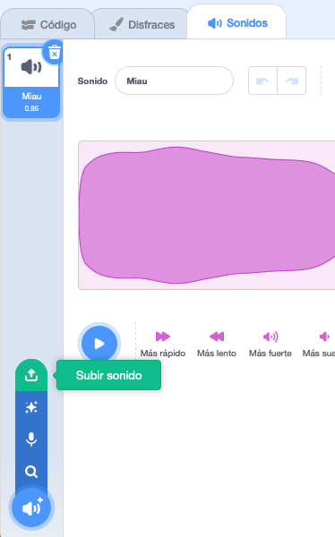

## Grabando tu timbre

Ahora grabemos el timbre de la puerta para que puedas reproducirlo fuera de Sonic Pi. Sonic Pi puede crear archivos `wav` que son archivos de sonido comúnmente usados.

+ Haz clic en el botón 'Rec' para comenzar a grabar.
    
    

+ Luego haz clic en "Ejecutar" para tocar tu timbre de la puerta.
    
    

+ Cuando termine, haz clic en 'Rec' nuevamente para detener la grabación y se te solicitará un nombre para el archivo. Llama a tu archivo 'doorbell.wav'.
    
    

+ Si tienes un programa que pueda reproducir archivos '.wav' entonces podrás reproducir tu timbre de puerta fuera de Sonic Pi.
    
    Consejo: Si no tienes otro programa que pueda reproducir archivos '.wav', entonces puedes importar el sonido a Scratch y reproducirlo.
    
    
    
    Consejo: Puede que necesites cerrar Sonic Pi para poder reproducir sonido usando otra aplicación.