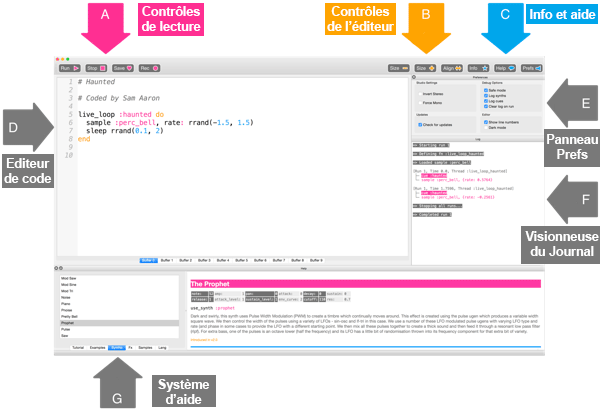
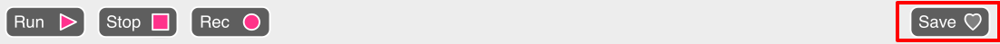

## Jouer tes premières notes

Sonic Pi te permet de programmer de la musique. Commençons par jouer de simples notes musicales.

[[[sonic-pi-install]]]

+ Lance Sonic Pi. Ton responsable de club pourra te dire où le trouver. Si tu utilises un Raspberry Pi alors c'est sous Programmation dans le menu.
    
    

+ Vois où ça dit « # Bienvenue dans Sonic Pi » ? En dessous, tape :
    
    

+ Clique sur « Run ». As-tu entendu une note musicale ? Dans le cas contraire, assures-toi que le son n'est pas muet sur ton ordinateur et que le volume est suffisamment élevé. Si le son est trop fort, diminue-le.
    
    Si tu utilises un Raspberry Pi alors assure-toi d'utiliser un moniteur HDMI avec des haut-parleurs ou des haut-parleurs ou des écouteurs connectés à la prise audio.
    
    Il y a aussi un réglage de volume sous « Prefs » que tu peux ajuster.

+ Maintenant, ajoute une autre ligne en dessous de ta première ligne :
    
    

+ Clique sur « Run ». Did you hear what you were expecting? In Sonic Pi, `play` means start playing, so it starts playing the first note and then immediately starts playing the second note so you hear both notes at the same time.

+ To get the second note to play after the first note add a `sleep 1` line in between so that your code looks like this:
    
    

+ Now run your code and it should sound like a doorbell chime.
    
    Listen and you should hear a higher note and then a lower one. Higher notes have higher numbers.
    
    

      <audio controls preload> <source src="resources/doorbell-1.mp3" type="audio/mpeg"> Your browser does not support the <code>audio</code> element. </audio>
    

+ Save your code by clicking on 'Save' and name your file 'doorbell.txt'.
    
    
    
    If you're not sure, check with your Club Leader where you should save your file.
    
    You can load files back into Sonic Pi by clicking on 'Load'.