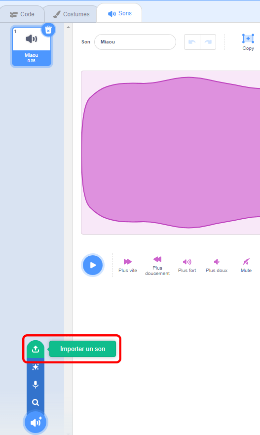

## Enregistrement de ta sonnerie

Maintenant enregistrons la sonnette de porte pour que tu puisses la jouer en dehors de Sonic Pi. Sonic Pi peut créer des fichiers `wav` qui sont des fichiers son couramment utilisés.

+ Clique sur le bouton « Rec » pour commencer l'enregistrement.
    
    

+ Puis clique sur « Run » pour jouer ta sonnerie.
    
    

+ Quand elle se termine, clique à nouveau sur « Rec » pour arrêter l'enregistrement et on te demandera un nom de fichier. Appelle ton fichier « doorbell.wav ».
    
    

+ Si tu as un programme qui peut lire des fichiers « .wav » alors tu seras en mesure de jouer ta sonnerie de porte en dehors de Sonic Pi.
    
    Astuce : Si tu n'as pas un autre programme qui peut jouer des fichiers « .wav », tu peux importer le son dans Scratch et le lire.
    
    
    
    Astuce : Tu devras peut-être fermer Sonic Pi pour pouvoir jouer du son en utilisant une autre application.