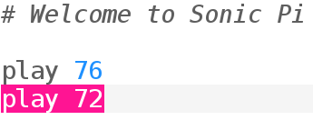

## अपने पहले स्वर बजाना

Sonic Pi से आप संगीत प्रोग्राम कर सकते हैं। आइए हम कुछ सरल संगीत स्वरों को चलाकर शुरू करें।

[[[sonic-pi-install]]]

+ Sonic Pi चलाना। आपका क्लब लीडर आपको बता सकेगा कि इसे कहाँ खोजना है। यदि आप Raspberry Pi का उपयोग कर रहे हैं तो यह मेनू में प्रोग्रामिंग के अंतर्गत है।
    
    

+ देखें कि यह '#Welcome to Sonic Pi' कहाँ पर कहता है? उसके नीचे टाइप करें:
    
    

+ 'Run' (चलाएँ) पर क्लिक करें। क्या आपको संगीत का कोई स्वर सुनाई दिया है? यदि नहीं, तो सुनिश्चित करें कि आपके कंप्यूटर पर ध्वनि को म्यूट नहीं किया गया है और यह कि वॉल्यूम पर्याप्त रूप से अधिक है। अगर आवाज़ बहुत तेज़ है तो उसे कम कर दें।
    
    यदि आप Raspberry Pi का उपयोग कर रहे हैं, तो सुनिश्चित करें कि आप स्पीकर के साथ HDMI मॉनिटर का उपयोग कर रहे हैं या स्पीकर या हेडफ़ोन ऑडियो जैक से जुड़े हैं।
    
    'Prefs' के अंतर्गत एक वॉल्यूम सेटिंग भी है जिसे आप समायोजित कर सकते हैं।

+ अब अपनी पहले वाली पंक्ति के नीचे एक और पंक्ति जोड़ें:
    
    

+ 'Run' (चलाएँ) पर क्लिक करें। क्या आपको वह सुनाई दिया जिसकीआप उम्मीद कर रहे थे? Sonic Pi में, `play` का मतलब है कि चलाना शुरू करें, इसलिए यह पहला स्वर चलाना शुरू कर देता है और फिर तुरंत दूसरा स्वर चलाना शुरू कर देता है ताकि आप दोनों स्वर एक ही समय पर सुन सकें।

+ दूसरे स्वर को पहले स्वर के बाद चलाने के लिए इन दोनों के बीच `sleep 1` पंक्ति जोड़ें ताकि आपका कोड इस तरह दिखे:
    
    

+ अब अपना कोड चलाएँ और यह एक डोरबेल की झंकार की तरह बजना चाहिए।
    
    सुनें और आपको पहले उच्च स्वर सुनाई देगा और फिर निम्न स्वर। उच्च स्वरों की संख्या बड़ी होती है।
    
    

      <audio controls preload> <source src="resources/doorbell-1.mp3" type="audio/mpeg"> आपका ब्राउज़र <code>audio</code> तत्व का समर्थन नहीं करता है। </audio>
    

+ 'सहेजें' पर क्लिक करके अपना कोड सहेजें और अपनी फ़ाइल का नाम 'doorbell.txt' रखें।
    
    
    
    यदि आप निश्चित नहीं हैं, तो अपने क्लब लीडर से पता करें कि आपको अपनी फ़ाइल को कहाँ सहेजना चाहिए।
    
    आप 'लोड' पर क्लिक करके फ़ाइलों को वापस Sonic Pi में लोड कर सकते हैं।