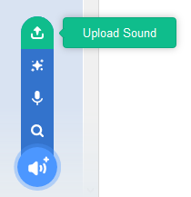

## अपनी झंकार को रिकॉर्ड करना

आइए अब हम डोरबेल की झंकार रिकॉर्ड करें ताकि आप इसे Sonic Pi के बाहर चला सकें। Sonic Pi `wav` फ़ाइलें बना सकता है जो आमतौर पर उपयोग की जाने वाली ध्वनि फ़ाइलें होती हैं।

+ रिकॉर्डिंग शुरू करने के लिए 'Rec' बटन पर क्लिक करें।
    
    

+ फिर अपनी डोरबेल की झंकार को बजाने के लिए 'Run' (चलाएँ) पर क्लिक करें।
    
    

+ जब यह समाप्त हो जाए तो रिकॉर्डिंग बंद करने के लिए फिर से 'Rec' पर क्लिक करें और आपको फ़ाइल का नाम रखने के लिए संकेत दिया जाएगा। अपनी फ़ाइल को 'doorbell.wav' नाम दें।
    
    

+ यदि आपके पास '.wav' फ़ाइलों को चला सकने वाला कोई प्रोग्राम है तो आप अपनी डोरबेल की झंकार को Sonic Pi के बाहर बजा पाएँगे।
    
    सुझाव: यदि आपके पास '.wav' फ़ाइलों को चला सकने वाला कोई दूसरा प्रोग्राम नहीं है तो आप ध्वनि को Scratch में import करके उसे चला सकते हैं।
    
    
    
    सुझाव: किसी अन्य ऐप का उपयोग करके ध्वनि चला सकने के लिए आपको Sonic Pi को बंद करने की ज़रूरत पड़ सकती है।