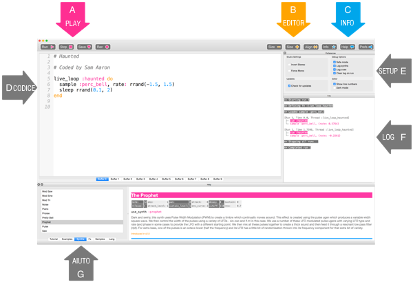
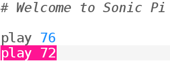

## Suona le tue prime note

Sonic Pi ti consente di programmare la musica. Cominciamo suonando alcune semplici note musicali.

[[[sonic-pi-install]]]

+ Esegui Sonic Pi. L'organizzatore del tuo club potrà spiegarti dove trovarlo. Se stai usando un Raspberry Pi, è nel menu Programmazione.
    
    

+ Vedi dove dice '#Welcome to Sonic Pi'? Di seguito digita:
    
    

+ Clicca su 'Run'. Hai sentito una nota musicale? In caso contrario, assicurati che l'audio non sia disattivato sul tuo computer e che il volume sia abbastanza alto. Se il suono è troppo forte, abbassalo.
    
    Se stai utilizzando un Raspberry Pi, assicurati di utilizzare un monitor HDMI con altoparlanti o avere cuffie o altoparlanti collegati al jack audio.
    
    C'è anche un'impostazione del volume in 'Prefs' che puoi regolare.

+ Ora aggiungi un'altra riga sotto la prima:
    
    

+ Clicca su 'Run'. Hai sentito ciò che ti aspettavi? Nella Sonic Pi, `play` significa far iniziare a suonare, così che inizia a suonare la prima nota e quindi inizia immediatamente a riprodurre la seconda nota in modo da sentire entrambe le note allo stesso tempo.

+ Per far suonare la seconda nota dopo la prima nota aggiungi una linea `sleep 1` in modo che il tuo codice sia simile al seguente:
    
    

+ Ora esegui il tuo codice e dovrebbe suonare come un campanello.
    
    Ascolta e dovresti sentire una nota più alta e poi una più bassa. Le note più alte hanno numeri più alti.
    
    

    <audio controls preload> 
      <source src="resources/doorbell-1.mp3" type="audio/mpeg"> 
    Il tuo browser non supporta l'elemento <code>audio</code>. 
    </audio>
    

+ Salva il tuo codice cliccando su 'Save' e chiama il tuo file 'doorbell.txt'.
    
    
    
    Se non sei sicuro, controlla con il responsabile del tuo club dove dovresti salvare il file.
    
    È possibile caricare nuovamente i file in Sonic Pi facendo clic su 'Load'.