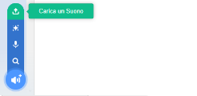

## Registra il tuo squillo

Ora registriamo lo squillo del campanello in modo da poterlo riprodurre al di fuori di Sonic Pi. Sonic Pi può creare file `wav`, un formato di file audio comunemente usato.

+ Fare clic sul pulsante 'Rec' per avviare la registrazione.
    
    

+ Poi clicca su 'Run' per far suonare il tuo campanello.
    
    

+ Al termine, fai di nuovo clic su "Rec" per interrompere la registrazione. Ti verrà richiesto un nome file. Chiama il tuo file 'doorbell.wav'.
    
    

+ Se hai un programma in grado di riprodurre file ".wav", potrai far suonare il tuo campanello al di fuori di Sonic Pi.
    
    Suggerimento: Se non hai un altro programma che può riprodurre i file '.wav' puoi importare il suono in Scratch e riprodurlo.
    
    
    
    Suggerimento: Potresti aver bisogno di chiudere Sonic Pi per poter riprodurre un suono usando un'altra applicazione.