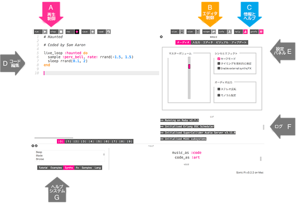

## 最初の音符を演奏する

Sonic Piを使うと音楽をプログラムすることができます。 かんたんな音符を再生することからはじめてみましょう。

[[[sonic-pi-install]]]

+ Sonic Piを実行します。 クラブ・リーダーがどこにあるのかを教えてくれます。 Raspberry Piを使っているなら、メニューの「プログラミング」にあります。
    
    

+ 「# Welcome to Sonic Pi」がどこに書かれているかわかりますか？ その下に次のように入力します。
    
    

+ 「run」をクリックします。 音符が聞こえましたか？ 聞こえない場合は、コンピュータの音が消音されていないこと、音量が十分に大きいことを確認してください。 音が大きすぎる場合は音量を下げてください。
    
    Raspberry Piを使っているなら、スピーカー付きモニタをHDMIで接続して使用するか、スピーカーやヘッドフォンがオーディオジャックに接続されているか確認してください。
    
    「prefs」にも音量を調節できる音量設定があります。

+ 次に、最初に追加した行の下に別の行を追加します。
    
    

+ 「run」をクリックします。 思ったとおりの音が聞こえましたか？ Sonic Piでは`play`は再生開始です。つまり、最初の音符を再生し、すぐに2番目の音符を再生するので、両方の音符が同時に聞こえます。

+ 最初の音符の後に2番目の音符を再生するには、次に示すように`sleep 1`を間に追加します：
    
    

+ ここでコードを実行すると、玄関（げんかん）の呼び鈴のような音が聞こえるはずです。
    
    耳をすますと、高い音が聞こえて、次に低い音が聞こえます。 高い音符ほど大きい数字になります。
    
    

    <audio controls preload> 
      <source src="resources/doorbell-1.mp3" type="audio/mpeg"> 
      お使いのブラウザは<code>audio</code>要素をサポートしていません。 
    </audio>
    

    
+ 「save」を押してコードを保存し、ファイルに「doorbell.txt」という名前をつけます。
    
    
    
    よくわからないときは、クラブ・リーダーにファイルをどこに保存するか確認してください。
    
    「load」をクリックするとSonic Piに保存したファイルを読み込めます。