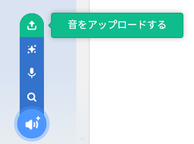

## 呼び鈴を録音する

次に、Sonic Pi以外で再生できるように玄関（げんかん）の呼び鈴を録音します。 Sonic Piは音声ファイルとして一般的に使われている`wav`ファイルを作成できます。

+ 「rec」を押して玄関（げんかん）の呼び鈴の録音を開始します。
    
    

+ 次に「run」を押して玄関（げんかん）の呼び鈴を再生します。
    
    

+ 再生が終了したら、もう一度「rec」を押して録音を停止します。すると、ファイル名の入力を求められます。 ファイル名を「doorbell.wav」にします。
    
    

+ 「wav」ファイルを再生できるプログラムがあれば、玄関（げんかん）の呼び鈴をSonic Pi以外で再生できます。
    
    ヒント：「wav」ファイルを再生する別のプログラムがないときは、Scrachに取り込んで再生できます。
    
    
    
    ヒント：別のアプリケーションで音声ファイルを再生するときは、Sonic Piを閉じる必要があるかもしれません。