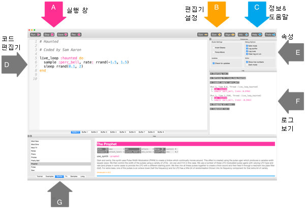
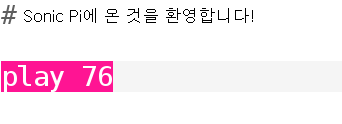
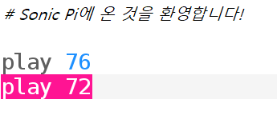
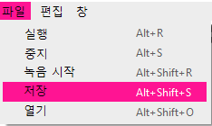

## 첫 음 연주하기

Sonic Pi로 음악을 프로그래밍 할 수 있습니다. 먼저 간단한 음 연주부터 해보겠습니다.

[[[sonic-pi-install]]]

+ Sonic Pi를 실행하세요. 선생님이 Sonic Pi를 어디서 찾을 수 있는지 알려줄 것입니다. 라즈베리파이를 사용한다면 그것은 메뉴창에서 Programming 아래에 있습니다.
    
    

+ '#Welcome to Sonic Pi'라고 쓰여 있는 곳을 보세요. 아래에 다음을 입력합니다:
    
    

+ 'Run'을 클릭하세요. 음을 들었나요? 그렇지 않다면 컴퓨터 소리가 음소거되지 않았는지, 볼륨이 충분히 높은지 확인하세요. 소리가 너무 크면 볼륨을 낮추세요.
    
    라즈베리파이를 사용하는 경우 스피커가 있는 HDMI 모니터를 사용하거나 오디오 잭에 스피커 또는 헤드폰을 연결해야 합니다.
    
    또한 'Prefs' 아래에 조정할 수 있는 볼륨 설정이 있습니다.

+ 이제 첫 번째 줄 아래에 새로운 줄을 추가합니다.
    
    

+ 'Run'을 클릭하세요. 예상대로 소리가 나오나요? Sonic Pi에서 `재생`은 소리를 재생한다는 의미이므로 첫 번째 음을 재생한 다음 두 번째 음을 동시에 재생해서 동시에 두 음을 같이 들을 수 있습니다.

+ 첫 번째 음 다음에 두 번째 음을 재생하려면 코드가 다음과 같도록 중간에 `sleep 1`을 추가합니다:
    
    

+ 이제 코드를 실행하면 초인종 소리처럼 들릴 것입니다.
    
    들어보면 높은 음과 낮은 음이 들릴 것입니다. 숫자가 높을 수록 음이 높습니다.
    
    

    <audio controls preload> 
      <source src="resources/doorbell-1.mp3" type="audio/mpeg"> 브라우저가 <code>오디오</code>를 지원하지 않습니다. 
    </audio>
    

+ 'Save'를 클릭하여 코드를 저장하고 파일 이름을 '초인종.txt'로 지정합니다.
    
    
    
    확실하지 않다면, 선생님에게 파일을 저장할 위치를 물어보세요.
    
    'Load'를 클릭하여 파일을 Sonic Pi에서 다시 열 수 있습니다.