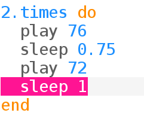

## 벨소리 반복하기

초인종은 종종 벨소리를 반복합니다.

+ 초인종 벨소리를 반복문에 넣어봅시다:
    
    
    
    Sonic Pi가 초인종 소리 코드를 `times` 반복문에 들여쓰기 하여 넣어줄 것입니다.

+ 벨소리를 들어보세요. 예상했던 대로 소리가 나오나요?
    
    반복하기 전에 일시 중지가 발생하도록 마지막에 `sleep` 라인을 추가해야 합니다:
    
    

+ 다시 들어보면 소리가 더 잘 날 것입니다:
    
    

    <audio controls preload> 
      <source src="resources/doorbell-2.mp3" type="audio/mpeg"> 브라우저가 <code>오디오</code>를 지원하지 않습니다. 
    </audio>
    
