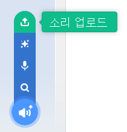

## 벨소리 녹음하기

이제 초인종 소리를 녹음하여 Sonic Pi 외부에서 재생할 수 있도록 합시다. Sonic Pi는 일반적으로 사용되는 소리 파일인 `wav` 파일을 만들 수 있습니다.

+ 'Rec' 버튼을 클릭하여 녹음을 시작합니다.
    
    

+ 그런 다음 'Run'을 클릭하여 초인종 소리를 재생합니다.
    
    

+ 소리 재생이 끝나면 'Rec'을 다시 클릭하여 기록을 중지하세요. 그러면 파일 이름을 입력하라는 메시지가 표시됩니다. 파일 이름을 'doorbell.wav'라고 저장합니다.
    
    

+ '.wav' 파일을 재생할 수 있는 프로그램이 있으면 Sonic Pi 밖에서 초인종 소리를 재생할 수 있습니다.
    
    팁: '.wav' 파일을 재생할 수 있는 다른 프로그램이 없는 경우 스크래치로 사운드를 가져와 재생할 수 있습니다.
    
    
    
    팁: 다른 앱을 사용하여 소리를 재생하려면 Sonic Pi를 닫아야 할 수도 있습니다.