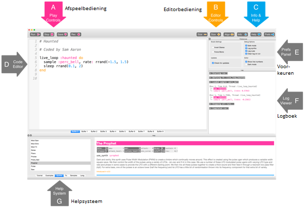

## Speel je eerste noten

Met Sonic Pi kun je muziek programmeren. Laten we beginnen met het spelen van enkele eenvoudige muzieknoten.

[[[sonic-pi-install]]]

+ Start Sonic Pi. Je clubleider kan je vertellen waar je deze kunt vinden. Als je een Raspberry Pi gebruikt, staat deze onder Programmeren in het menu.
    
    

+ Zie je waar '#Welcome to Sonic Pi' staat? Hieronder typ:
    
    

+ Klik op 'Run'. Hoorde je een muzieknoot? Zo niet, zorg ervoor dat het geluid niet gedempt is op je computer en dat het volume hoog genoeg is. Als het geluid te hard is, zet het dan zachter.
    
    Als je een Raspberry Pi gebruikt, zorg er dan voor dat je een HDMI-monitor met luidsprekers gebruikt of dat luidsprekers of koptelefoons zijn aangesloten op de audio-aansluiting.
    
    Er is ook een volume-instelling onder 'Prefs' die je kunt aanpassen.

+ Voeg nu nog een regel toe onder je eerste:
    
    

+ Klik op 'Run'. Hoorde je wat je verwachtte? In Sonic Pi, `play` betekent beginnen met spelen, dus begint het de eerste noot te spelen en begint meteen de tweede noot te spelen, dus je hoort beide noten tegelijkertijd.

+ Om de tweede noot na de eerste noot af te spelen voeg je een regel met `sleep 1` toe, zodat je code er als volgt uitziet:
    
    

+ Voer nu je code uit en het zou moeten klinken als een deurbel.
    
    Luister en je zou een hogere noot moeten horen en dan een lagere. Hogere noten hebben hogere getallen.
    
    

    <audio controls preload> 
      <source src="resources/doorbell-1.mp3" type="audio/mpeg"> 
    Je browser ondersteunt het element <code>audio</code> niet. 
    </audio>
    

+ Sla je code op door op 'Save' te klikken en noem je bestand 'deurbel.txt'.
    
    
    
    Als je het niet zeker weet, neem dan contact op met je clubleider waar je je bestand moet opslaan.
    
    Je kunt bestanden weer in Sonic Pi laden door op 'Load' te klikken.