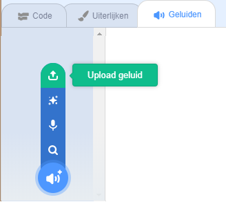

## Je bel opnemen

Laten we nu de deurbel opnemen, zodat je het buiten Sonic Pi kunt afspelen. Sonic Pi kan `wav`-bestanden maken die vaak gebruikt worden als geluidsbestanden.

+ Klik op de 'Rec' knop om de opname te starten.
    
    

+ Klik vervolgens op 'Run' om je deurbel af te spelen.
    
    

+ Als het klaar is, klik nogmaals op 'Rec' om de opname te stoppen en je wordt om een bestandsnaam gevraagd. Noem je bestand 'deurbel.wav'.
    
    

+ Als je een programma hebt dat '.wav'-bestanden kan afspelen, dan kun je je deurbel buiten Sonic Pi afspelen.
    
    Tip: als je geen ander programma hebt dat '.wav'-bestanden kan afspelen, kun je het geluid importeren in Scratch en het daar afspelen.
    
    
    
    Tip: mogelijk moet je Sonic Pi afsluiten om geluid te kunnen afspelen met een andere app.