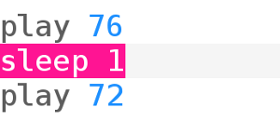

## Zagraj swoje pierwsze nuty

Sonic Pi pozwala programować muzykę. Zacznijmy od zagrania prostych nut.

[[[sonic-pi-install]]]

+ Uruchom Sonic Pi. Twój lider klubu będzie mógł powiedzieć ci, gdzie go znaleźć. Jeśli używasz Raspberry Pi, to jest to w menu Programowanie.
    
    

+ Widzisz gdzie jest napisane '#Welcome to Sonic Pi'? Poniżej wpisz:
    
    

+ Kliknij „Run". Czy słyszałeś nutę? Jeśli nie, upewnij się, że dźwięk nie jest wyciszony na komputerze i że głośność jest wystarczająco głośna. Jeśli dźwięk jest za głośny, ścisz go.
    
    Jeśli używasz Raspberry Pi, upewnij się, że używasz monitora HDMI z głośnikami lub że masz głośniki lub słuchawki podłączone do gniazda audio (gniazdo jack).
    
    Są też ustawienia głośności w "Prefs" które możesz ustawić.

+ Teraz dodaj kolejną linię poniżej pierwszej:
    
    

+ Kliknij „Run”. Czy usłyszałeś to, czego się spodziewałeś? W Sonic Pi `play` oznacza zacznij grać, więc zaczyna grać pierwszą nutę, a następnie natychmiast zaczyna grać drugą nutę, dzięki czemu słyszysz obie nuty jednocześnie.

+ Aby zagrać drugą nutę po pierwszej nucie, dodaj `sleep 1` między nimi, aby Twój kod wyglądał tak:
    
    

+ Teraz uruchom kod. Powinien on brzmieć jak dzwonek do drzwi.
    
    Posłuchaj. Powinieneś usłyszeć wyższą nutę, a następnie niższą. Wyższe nuty mają wyższe liczby.
    
    

    <audio controls preload> 
      <source src="resources/doorbell-1.mp3" type="audio/mpeg"> 
    Twoja przeglądarka nie obsługuje elementów <code>audio</code>. 
    </audio>
    

+ Zapisz kod, klikając „Save” i nazwij swój plik „dzwonek.txt”.
    
    
    
    Jeśli nie jesteś pewien, zapytaj się swojego Lidera Klubu, gdzie powinieneś zapisać plik.
    
    Możesz załadować pliki z powrotem do Sonic Pi, klikając „Load”.