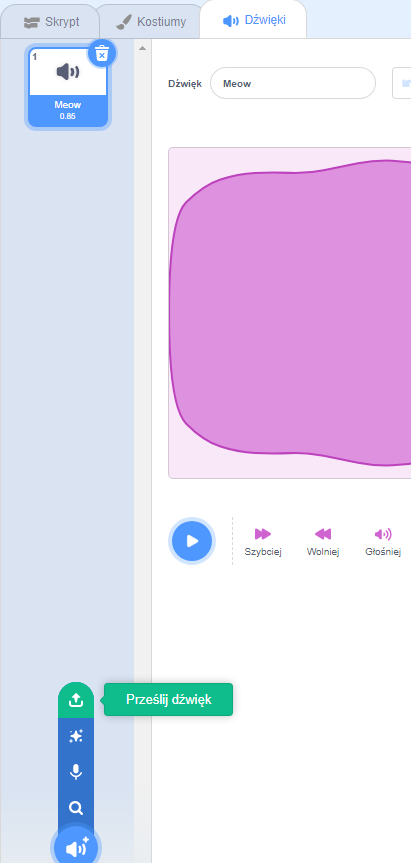

## Recording your chime

Now let's record the doorbell chime so that you can play it outside of Sonic Pi. Sonic Pi can create `wav` files which are commonly used sound files.

+ Click on the 'Rec' button to start recording.
    
    

+ Then click 'Run' to play your doorbell chime.
    
    

+ When it finishes click 'Rec' again to stop recording and you will be prompted for a filename. Call your file 'doorbell.wav'.
    
    

+ If you have a program that can play '.wav' files then you'll be able to play your doorbell chime outside of Sonic Pi.
    
    Tip: If you don't have another program that can play '.wav' files then you could import the sound into Scratch and play it.
    
    
    
    Tip: You may need to close Sonic Pi to be able to play sound using another app.