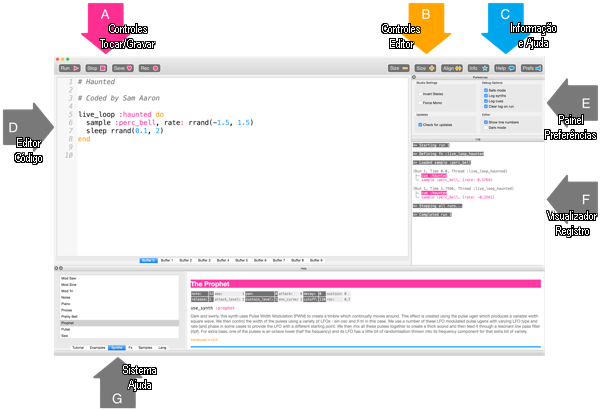

## Toque suas primeiras notas

O Sonic Pi permite programar músicas. Vamos começar tocando algumas notas musicais simples.

[[[sonic-pi-install]]]

+ Execute o Sonic Pi. O seu líder de clube poderá informar onde encontrá-lo. Se você estiver usando um Raspberry Pi, ele estará em Programação no menu.
    
    

+ Veja onde está escrito '#Welcome to Sonic Pi'? Abaixo, digite:
    
    

+ Clique em 'Run'. Você ouviu uma nota musical? Caso contrário, verifique se o som não está mudo no seu computador e se o volume está alto o suficiente. Se o som estiver muito alto, diminua-o.
    
    Se você estiver usando um Raspberry Pi, verifique se está usando um monitor HDMI com alto-falantes ou se possui alto-falantes ou fones de ouvido conectados à saída de áudio.
    
    Há também uma configuração de volume em 'Prefs' que você pode ajustar.

+ Agora adicione outra linha abaixo da sua primeira:
    
    

+ Clique em 'Run'. Você ouviu o que estava esperando? No Sonic Pi, `play` significa começar a tocar, então ele toca a primeira nota e logo em seguida começa a tocar a segunda nota, então você escuta as duas notas ao mesmo tempo.

+ Para que a segunda nota seja reproduzida após a primeira, adicione a linha `sleep 1` no meio para que seu código fique assim:
    
    

+ Agora execute seu código e ele deve soar como um toque de campainha.
    
    Ouça e você deve ouvir uma nota mais alta e depois uma mais baixa. Notas mais altas têm números mais altos.
    
    

    <audio controls preload> 
      <source src="resources/doorbell-1.mp3" type="audio/mpeg"> 
    Seu navegador não suporta o elemento de <code>áudio</code>. 
    </audio>
    

+ Salve seu código clicando em 'Save' e nomeie seu arquivo 'campainha.txt'.
    
    
    
    Se você não tiver certeza, verifique com o seu Líder do Clube onde você deve salvar seu arquivo.
    
    Você pode carregar os arquivos novamente no Sonic Pi clicando em 'Load'.