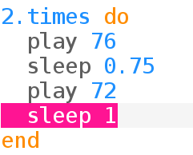

## Repita a harmonia

Campainhas normalmente repetem a harmonia.

+ Vamos colocar a campainha tocando em um loop:
    
    
    
    O Sonic Pi recuará o código da campainha dentro do loop `times`.

+ Escute a harmonia. É o que você esperava?
    
    Você precisará adicionar uma linha `sleep` no final para que haja uma pausa antes de repetir:
    
    

+ Ouça a harmonia novamente e ela deve soar melhor.
    
    

    <audio controls preload> 
      <source src="resources/doorbell-2.mp3" type="audio/mpeg"> 
    Seu navegador não suporta o elemento de <code>áudio</code>. 
    </audio>
    
