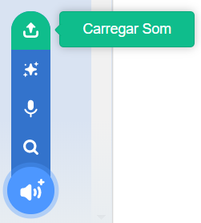

## Gravando sua harmonia

Agora vamos gravar a harmonia da campainha para que você possa tocá-la fora do Sonic Pi. O Sonic Pi pode criar arquivos `wav` que são arquivos de som comumente usados.

+ Clique no botão 'Rec' para iniciar a gravação.
    
    

+ Em seguida, clique em 'Run' para tocar a harmonia.
    
    

+ Quando terminar, clique em 'Rec' novamente para interromper a gravação e você será solicitado a fornecer um nome de arquivo. Nomeie seu arquivo de 'campainha.wav'.
    
    

+ Se você possui um programa que pode reproduzir arquivos '.wav', poderá tocar a campainha fora do Sonic Pi.
    
    Dica: Se você não tiver outro programa que possa reproduzir arquivos '.wav', você pode importar o arquivo de som para o Scratch e reproduzi-lo.
    
    
    
    Dica: Pode ser necessário fechar o Sonic Pi para reproduzir som usando outro aplicativo.