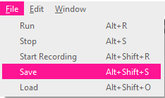

## Redă primele note

Sonic Pi îți permite să programezi muzică. Să începem prin redarea unor note muzicale simple.

[[[sonic-pi-install]]]

+ Pornește Sonic Pi. Liderul clubului tău îți va spune unde să îl găsești. Dacă folosești un Raspberry Pi, atunci este în meniul Programare.
    
    

+ Vezi unde se afișează "#Welcome to Sonic Pi"? Scrie dedesubt:
    
    

+ Fă clic pe "Run". Ai auzit o notă muzicală? Dacă nu, asigură-te că sunetul nu este dezactivat pe computer și că volumul este suficient de ridicat. Dacă sunetul este prea puternic, dă-l mai încet.
    
    Dacă folosești un Raspberry Pi, asigură-te că ai fie un monitor HDMI cu difuzoare, fie difuzoare sau căști conectate la mufa audio.
    
    De asemenea, există în "Prefs" o setare a volumului pe care o poți ajusta.

+ Acum, adaugă o altă linie sub prima:
    
    

+ Fă clic pe "Run". Ai auzit ceea ce așteptai? În Sonic Pi, `play` înseamnă pornește redarea, așa că va începe să redea prima notă și apoi începe imediat redarea celei de-a doua note, astfel încât vei auzi ambele note în același timp.

+ Pentru a face ca a doua notă să fie redată după prima, adaugă o linie `sleep 1` între cele două note, astfel încât codul tău să arate astfel:
    
    

+ Acum execută codul și ar trebui să sune ca o sonerie.
    
    Ascultă și ar trebui să auzi o notă mai înaltă și apoi una mai joasă. Notele mai mari au numere mai mari.
    
    

      <audio controls preload> <source src="resources/doorbell-1.mp3" type="audio/mpeg"> Browserul tău nu acceptă elementul <code>audio</code>. </audio>
    

+ Salvează codul dând clic pe 'Save' și denumește fișierul 'doorbell.txt'.
    
    
    
    Dacă nu sunteți sigur, contactați-vă pe Club Leader unde să salvați fișierul.
    
    Puteți încărca fișierele înapoi în Sonic Pi făcând clic pe "Încărcare".