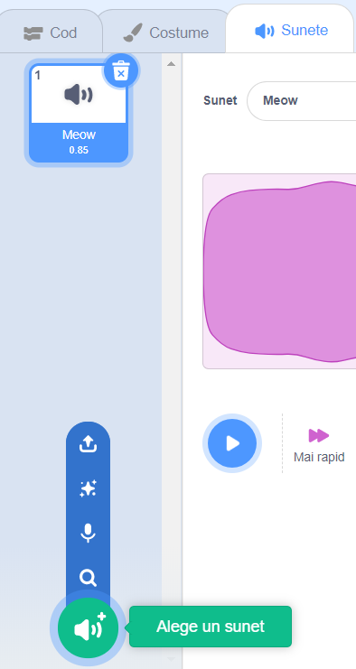

## Înregistrarea soneriei

Acum, să înregistrăm sunetul soneriei pentru a putea juca în afara lui Sonic Pi. Sonic Pi poate crea `wav` fișiere care sunt utilizate în mod obișnuit de fișiere de sunet.

+ Faceți clic pe butonul "Rec" pentru a începe înregistrarea.
    
    

+ Apoi, dați clic pe "Executare" pentru a reda sunetul soneriei.
    
    

+ Când se termină, faceți din nou clic pe "Rec" pentru a opri înregistrarea și vi se va solicita un nume de fișier. Sunați-vă fișierul "doorbell.wav".
    
    

+ Dacă aveți un program care poate reda fișiere ".wav", atunci veți putea să vă jucați sunetul soneriei în afara sonic Pi.
    
    Sfat: dacă nu aveți un alt program care să poată reda fișierele .wav, puteți să importați sunetul în Scratch și să îl redați.
    
    
    
    Sfat: Este posibil să fie necesar să închideți Sonic Pi pentru a putea reda sunet utilizând altă aplicație.