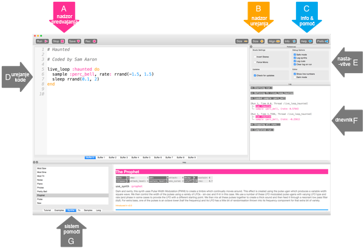

## Zaigraj svoje prve note

Sonic Pi omogoča programiranje glasbe. Začni tako, da zaigraš nekaj preprostih not.

[[[sonic-pi-install]]]

+ Zaženi Sonic Pi. Vodja tvojega kluba ti ga bo pomagal poiskati. Če uporabljaš Rasberry Pi, se nahaja v razdelku Programiranje v meniju.
    
    

+ Poglej, kje se nahaja pozdrav '#Welcome to Sonic Pi'. Pod tem napiši:
    
    

+ Klkni "Run". Si slišal-a glasbeno noto? Če nisi, preveri ali zvok računalnika ni utišan in ali je glasnost dovolj velika. Če je zvok preglasen, ga utišaj.
    
    Če uporabljaš Raspberry Pi, se prepričaj, da uporabljaš HDMI monitor z zvočniki ali da imaš zvočnike ali slušalke priključene na zvočni izhod.
    
    Pod "Prefs" se nahaja tudi nastavitev glasnosti, ki jo lahko spreminjaš.

+ Sedaj pod prvo vrstico dodaj še eno:
    
    

+ Klkni "Run". Si zaslišal-a, kar si pričakoval-a? V Sonic Pi-ju `play` pomeni začetek predvajanja, tako da najprej zaigra prvo noto in takoj nato drugo, zaradi česar hkrati slišimo obe noti.

+ Da bi bila druga nota odigrana po prvi, dodaj vrstico `sleep 1`, da bo tvoja koda videti tako:
    
    

+ Sedaj pa zaženi svojo kodo in slišati bi moral-a hišni zvonec.
    
    Prisluhni. Najprej bi moral-a slišati višji ton, nato pa nižji. Višje note imajo večje številke.
    
    

    <audio controls preload> 
        <source src="resources/doorbell-1.mp3" type="audio/mpeg"> 
        Brskalnik ne podpira <code>audio</code> elementa. 
    </audio>
    

    
+ Shrani kodo s likom na 'Save' in poimenuj svojo datoteko 'hisnizvonec.txt'.
    
    
    
    Če nisi prepričan-a, naj ti vodja kluba pove, kam lahko shraniš datoteko.
    
    Datoteke lahko naložiš nazaj v Sonic Pi s klikom na 'Load'.