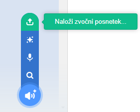

## Snemanje zvonca

Sedaj posnamimo hišni zvonec, da ga boš lahko predvajal-a zunanj programa Sonic Pi. Sonic pi lahko ustvari datoteke `wav`, ki so pogosto uproabljene za shranjevanje zvoka.

+ Klikni na gumb 'Rec' za začetek snemanja.
    
    

+ Nato klikni na 'Run', da se hišni zvonec predvaja.
    
    

+ Ko je predvajanje zaključeno, zopet klikni na 'Rec', da zaustaviš snemanje, na kar bo potrebno vnesti ime datoteke. Datoteko poimenuj 'hisnizvonec.wav'.
    
    

+ Če imaš program, ki zna predvajati datoteke '.wav', boš lahko predvajal-a tvoj hišni zvonec zunaj Sonic Pi-ja.
    
    Namig: Če nimaš programa, ki zna predvajati '.wav' datoteke, lahko te uvoziš v Scratch in jih predvajaš tam.
    
    
    
    Namig: Za predvajanje zvoka v drugem programu bo morda potrebno zapreti Sonic Pi.