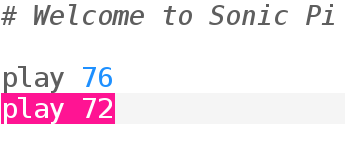

## İlk notlarınızı çalın

Sonic Pi müzik programlamanızı sağlar. Birkaç basit nota çalarak başlayalım.

[[[sonic-pi-install]]]

+ Sonic Pi'yi çalıştırın. Kulüp Lideriniz size bunu nerede bulabileceğinizi söyleyebilecektir. Eğer Raspberry Pi kullanıyorsanız, menüden Programlama seçeneğinin altında bulabilirsiniz.
    
    

+ '#Sonic Pi'ye Hoşgeldiniz'? yazısını gördünüz mü? Bunun altına şunu yazın:
    
    

+ "Çalıştır"a tıklayın. Bir müzik notası duydunuz mu? Duymadıysanız, öncelikle bilgisayar sesinin kapalı olup olmadığını, ya da sesin kısık olup olmadığını kontrol edin. Eğer ses çok yüksekse, sesi kısın.
    
    Raspberry Pi kullanıyorsanız, hoparlörlü bir HDMI monitör kullandığınızdan veya hoparlörünüzün ya da kulaklığınızın bilgisayarınıza bağlı olduğundan emin olun.
    
    Ayrıca 'Tercihler' seçeneğinden ses seviyesini ayarlayabilirsiniz.

+ Şimdi ilk satırınızın altına başka bir satır ekleyin:
    
    

+ "Run"a tıklayın. Sesi duydunuz mu? Sonic Pi'de `play` oynatmayı başlat anlamına gelir, yani önce ilk notayı hemen sonra da ikinci notayı çalmaya başlar, böylece her iki notayı da aynı anda duyarsınız.

+ İkinci notayı birinciden sonra çalmak için, iki nota arasına `sleep 1` komutunu eklerseniz kodunuz şöyle görünecektir:
    
    

+ Şimdi, kodunuzu tekrar çalıştırdığınızda bir kapı ziline benzeyecektir.
    
    Sesi dinlediğinizde önce yüksek bir ses, sonra daha düşük bir ses duyacaksınız. Yüksek notaların sayıları da daha yüksektir.
    
    

      <audio controls preload> <source src="resources/doorbell-1.mp3" type="audio/mpeg"> Your browser does not support the <code>audio</code> element. </audio>
    

+ Kodunuzu 'Kaydet'i tıklayarak kaydedin ve dosyanızı' doorbell.txt' olarak adlandırın.
    
    
    
    Eğer dosyanızı nereye kaydetmeniz gerektiğinden emin değilseniz, Kulüp Liderinize sorabilirsiniz.
    
    Dosyaları tekrar Sonic Pi'ya yüklemek için 'Yükle'ye tıklayın.