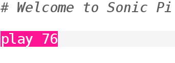

## Play your first notes

Sonic Pi allows you to program music. Let's start by playing some simple musical notes.

[[[sonic-pi-install]]]

+ Run Sonic Pi. Your Club Leader will be able to tell you where to find it. If you're using a Raspberry Pi then it's under Programming on the menu.
    
    

+ See where it says '#Welcome to Sonic Pi'? Below there type:
    
    

+ Click 'Run'. Did you hear a musical note? If not, make sure that the sound isn't muted on your computer and that the volume is high enough. If the sound is too loud turn it down.
    
    If you're using a Raspberry Pi then make sure you are using either an HDMI monitor with speakers or have speakers or headphones connected to the audio jack.
    
    There's also a volume setting under 'Prefs' that you can adjust.

+ Now add another line below your first one:
    
    

+ Click 'Run'. Did you hear what you were expecting? In Sonic Pi, `play` means start playing, so it starts playing the first note and then immediately starts playing the second note so you hear both notes at the same time.

+ To get the second note to play after the first note add a `sleep 1` line in between so that your code looks like this:
    
    

+ Now run your code and it should sound like a doorbell chime.
    
    Listen and you should hear a higher note and then a lower one. Higher notes have higher numbers.
    
    

      <audio controls preload> <source src="resources/doorbell-1.mp3" type="audio/mpeg"> Your browser does not support the <code>audio</code> element. </audio>
    

+ Save your code by clicking on 'Save' and name your file 'doorbell.txt'.
    
    
    
    If you're not sure, check with your Club Leader where you should save your file.
    
    You can load files back into Sonic Pi by clicking on 'Load'.