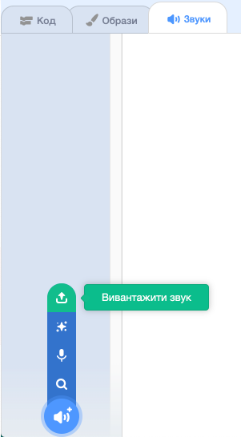

## Запис свого дзвону

Тепер давай запишемо звук твого дзвінка, щоб ти міг (могла) відтворювати його, не використовуючи Sonic Pi. Sonic Pi може створювати файли `wav`, які є популярними звуковими файлами.

+ Натисни на кнопку "Rec" для початку запису.
    
    

+ Далі натисни "Run", щоб відтворити дверний дзвінок.
    
    

+ Коли він закінчиться, знову натисни "Rec", щоб зупинити запис, після чого тобі треба буде ввести ім’я файлу. Назви свій файл "дзвінок.wav".
    
    

+ Якщо в тебе є програма, яка може відтворювати файли ".wav", то ти можеш відтворити свою мелодію дзвінка, не використовуючи Sonic Pi.
    
    Порада: Якщо в тебе немає програми, яка може відтворювати файли ".wav", тоді ти можеш імпортувати звук в Скретч і відтворити його там.
    
    
    
    Порада: Тобі може бути необхідно закрити Sonic Pi, щоб мати можливість відтворювати звук в іншій програмі.