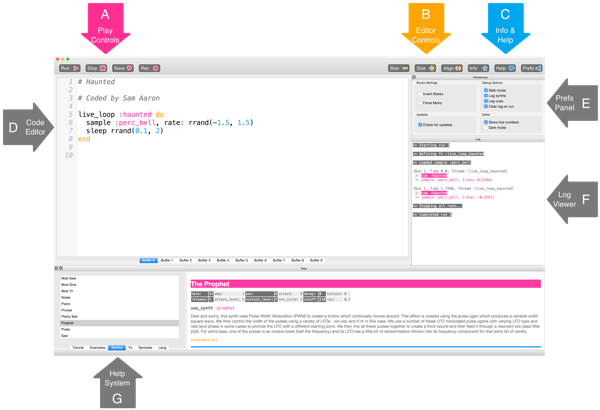
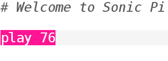
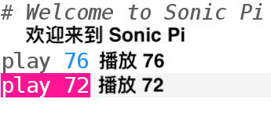
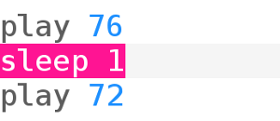

## 演奏你的第一个音符

Sonic Pi允许你编写音乐。 让我们从演奏一些简单的音符开始。

[[[sonic-pi-install]]]

+ 运行Sonic Pi。 您的俱乐部的指导老师会够告诉你在哪里可以找到它。 如果你正在使用树莓派，那么它就在菜单中的“编程”里。
    
    

+ 看看哪里写着“ #Welcome to Sonic Pi”？ 在下面输入：
    
    

+ 点击“运行”。 你听到音符了吗？ 如果不是，请确保计算机上未被静音，并且音量足够大。 如果声音太大，请将其调低。
    
    如果您使用的是树莓派，请确保使用带扬声器的HDMI显示器，或者将扬声器或耳机连接到音频插孔。
    
    您还可以在“偏好设置”下调整音量。

+ 现在，在您的第一个音符下面添加另一行：
    
    

+ 点击“运行”。 你听到你的期望的音符了吗？ 在Sonic Pi中，`播放`表示开始演奏，因此它开始演奏第一个音符，然后立即开始演奏第二个音符，以便你能同时听到两个音符。

+ 要使第二个音符在第一个音符之后播放，请两行代码之间之间插入一行，以添加` sleep 1 `，这样您的代码如下所示：
    
    

+ 现在运行您的代码，它听起来会像是门铃。
    
    仔细听，你应该听到一个较高的音符，然后是一个较低的音符。 较高的音符具有较高的编号。
    
    

      <audio controls preload> <source src="resources/doorbell-1.mp3" type="audio/mpeg"> Your browser does not support the <code>audio</code> element. </audio>
    

+ 单击“保存”保存代码，并将文件命名为“ doorbell.txt”。
    
    
    
    如果不确定，请与俱乐部的指导老师联系，确定应在哪里保存文件。
    
    您可以通过单击“加载”将文件加载回Sonic Pi。