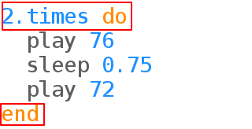
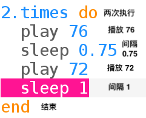

## 重复铃声

门铃经常重复发出提示音。

+ 让我们把铃声放入一个循环：
    
    
    
    Sonic Pi 将有助于在 `times` 循环内缩进门钟代码。

+ 听铃声。 这是你所期望的铃声吗？
    
    您需要在结尾添加一个`sleep`的行，以便在重复之前暂停：
    
    

+ 再听铃声，它听起来应该会更好。
    
    

      <audio controls preload> <source src="resources/doorbell-2.mp3" type="audio/mpeg"> Your browser does not support the <code>audio</code> element. </audio>
    
