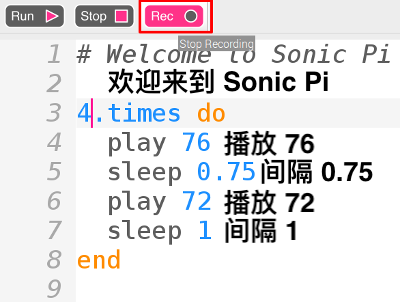
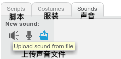

## 录制你的铃声

现在，让我们录制一下门铃的铃声，以便你可以在Sonic Pi之外播放。 Sonic Pi可以创建常用的` wav `声音文件。

+ 单击“录制”按钮开始录制。
    
    

+ 然后单击“运行”播放门铃。
    
    

+ 完成后，再次单击“录制”以停止录制，系统将提示你输入文件名。 将该文件命名为“ doorbell.wav”。
    
    

+ 如果您有可以播放'.wav'文件的程序，则可以在Sonic Pi之外播放门铃铃声。
    
    提示：如果没有其他可以播放'.wav'文件的程序，则可以将声音导入Scratch并进行播放。
    
    
    
    提示：您可能需要关闭Sonic Pi才能使用其他应用程序播放声音。