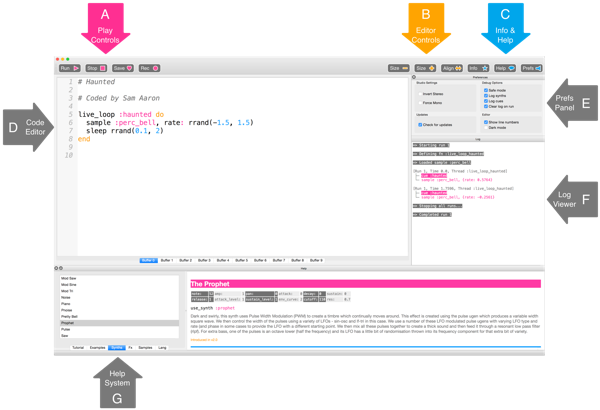

## 演奏您的第一個音符

Sonic Pi允許您編寫音樂。 讓我們從演奏一些簡單的音符開始。

[[[sonic-pi-install]]]

+ 運行Sonic Pi。 您的俱樂部的指導老師會告訴您可以從哪裡找到它。 如果您在使用 Raspberry Pi ，那麼他就在目錄中的「程式設計」裡。
    
    

+ 看看哪裡寫著「#歡迎來到 Sonic Pi」？ 請在下方輸入：
    
    

+ 點擊「運行」。 您聽到音符了嗎？ 如果沒聽到，請確認電腦沒有開靜音，並且音量夠大。 如果聲音太大，請將音量調低。
    
    如果您使用的是Raspberry Pi，請確保使用帶喇叭的HDMI螢幕，或者將喇叭或耳機連接到音頻插孔。
    
    您也可以在「偏好設置」中調整音量。

+ 現在，請在您的第一個音符下面添加另一行：
    
    

+ 點擊「運行」。 您聽到您期望的音符了嗎？ 在Sonic Pi中，`play`表示開始演奏，因此它開始演奏第一个音符，然后立即開始演奏第二个音符，以便您能同时聽到兩個音符。

+ 若想使第二個音符在第一個音符之後播放，請在兩行程式碼之間添加`sleep 1`，您的程式碼看起來會是這樣：
    
    

+ 現在運行你的程式碼，它聽起來會像個門鈴聲。
    
    仔細聽，你會聽到一個較高的音符，然後是一個較低的音符。 較高的音符有著較高的編號。
    
    

      <audio controls preload> <source src="resources/doorbell-1.mp3" type="audio/mpeg"> 您的瀏覽器不支援 <code>audio</code>。 </audio>
    

+ 點擊「儲存」來保存你的程式碼，並將文件命名為「doorbell.txt」。
    
    
    
    若有任何不確定，請向指導老師確認文件的儲存位置。
    
    您可以點擊「加載」將文件下載回Sonic Pi 。