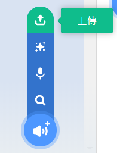

## 錄下您的鈴聲

現在，讓我們來錄下門鈴的鈴聲，這樣您也可以在 Sonic Pi之外播放。 Sonic Pi可以建立常用的`wav`音檔。

+ 點擊「錄製」按鈕開始錄音。
    
    

+ 然後點擊「運行」來播放您的門鈴。
    
    

+ 完成後，再次點擊「錄製」來停止錄音，系統將提示您輸入文件名稱。 將該檔案命名為「doorbell.wav」。
    
    

+ 如果您有可以播放「.wav」檔案的程式，您就可以在Sonic Pi之外播放門鈴鈴聲。
    
    小提示：如果您沒有其他可以播放「.wav」檔案的程式，您可以將檔案導入Scratch並播放。
    
    
    
    小提示：您可能需要關閉Sonic Pi 才能使用其他應用程式來播放聲音。